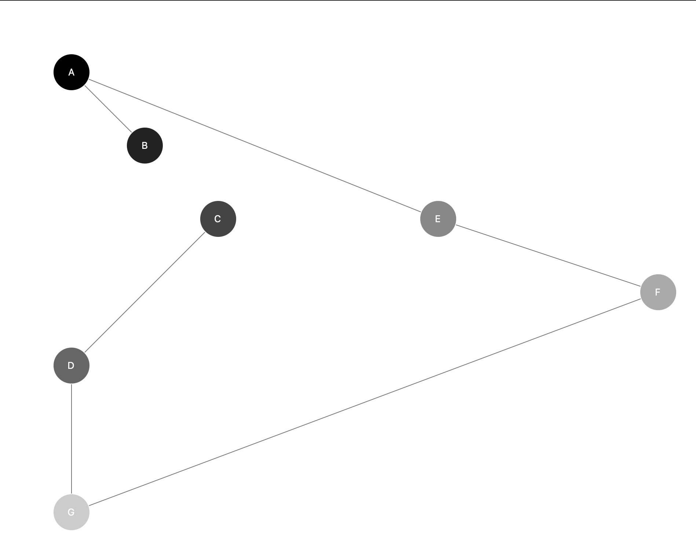
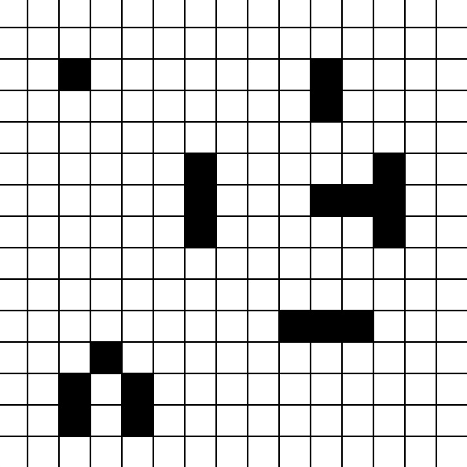
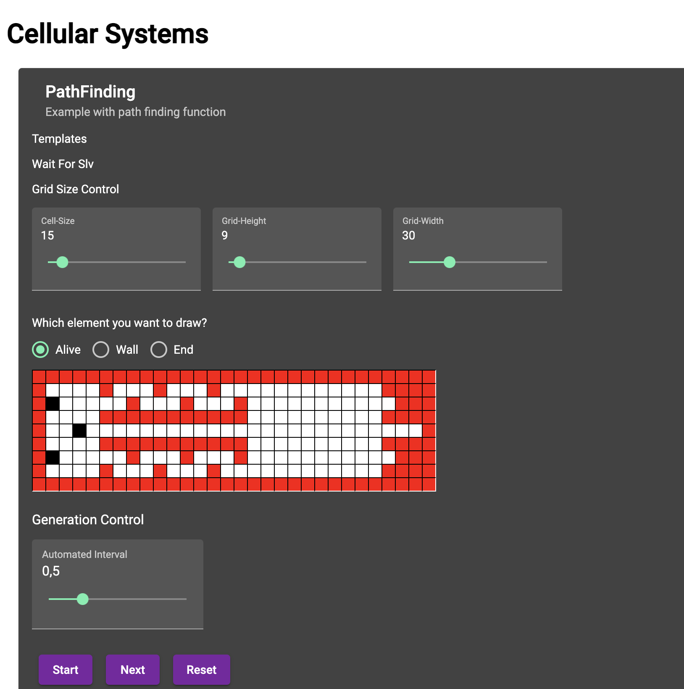

# University-Exercises-Artificial-Intelligence

This is the git repo of some exercises to try some ai algorithms of my university course.\
The detail README files are in the specific folders. You can use the links below to navigate to it.

## A-Star Algorithm

[See here](a_star)\

## Traveling salesman problem (with genetic algorithm)

[See here](traveling_salesman)\

## Cellular systems

[See here](cellular_systems)\

## Cellular path finding

[See here](cellular_path_finding)\
