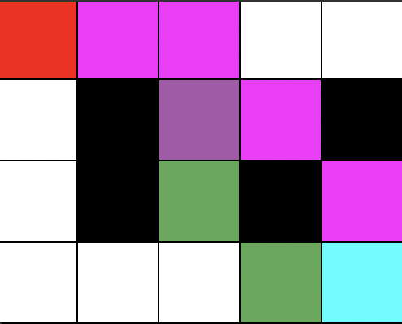

# A-Star Algorithm

This is a python script to try the a-star algorithm.

## Usage
```shell
python3 a_star.py

--help -h: show usage
--width -w: width of the grid in blocks
--height: height of the grid in blocks
--start -s: coordinates of the startnode {x,y}
--end -e: coordinated of the enndnode {x,y}
--normal-costs -n: normal costs
--diagonal-costs -d: diagonal costs
--blocked-nodes -b: list of blocked nodes (walls) {x,y} {x,y} ...
```

### Example
In this example you see a 5x4 grid.\
The starting point is on the 
position x = 0 and y = 3.\
The end point is on the position x = 4 and y = 0.\
The normal costs are 10 and the diagonal costs are 14.\
We have 4 wall elements on 1|1, 1|2, 3|1 and 4|2.

It looks like something like this.\
y\
3 s □ □ □ □\
2 □ ■ □ □ ■\
1 □ ■ □ ■ □\
0 □ □ □ □ e\
n 0 1 2 3 4 x

```shell
python3 a_star.py --height 4 -w 5 -s 0,3 -e 4,0 -n 10 -d 14 -b 1,1 1,2 3,1 4,2
```

Output\


```shell
Paths found: 3

0 - PATH
--------------------------------
x,y: 0,3 - s:52, g:0, h:52
x,y: 1,3 - s:52, g:10, h:42
x,y: 2,2 - s:52, g:24, h:28
x,y: 2,1 - s:58, g:34, h:24
x,y: 3,0 - s:58, g:48, h:10
x,y: 4,0 - s:58, g:58, h:0

1 - PATH
--------------------------------
x,y: 0,3 - s:52, g:0, h:52
x,y: 1,3 - s:52, g:10, h:42
x,y: 2,2 - s:52, g:24, h:28
x,y: 3,2 - s:58, g:34, h:24
x,y: 4,1 - s:58, g:48, h:10
x,y: 4,0 - s:58, g:58, h:0

2 - PATH
--------------------------------
x,y: 0,3 - s:52, g:0, h:52
x,y: 1,3 - s:52, g:10, h:42
x,y: 2,3 - s:58, g:20, h:38
x,y: 3,2 - s:58, g:34, h:24
x,y: 4,1 - s:58, g:48, h:10
x,y: 4,0 - s:58, g:58, h:0
```