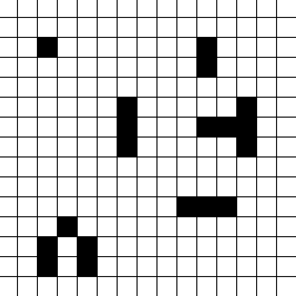

# A-Star Algorithm

This is a python script to try cellular systems.

## Usage
```shell
python3 cellular_systems.py {height} {width} {block_size}
```

height = height in blocks\
width = width in blocks\
block_size = size of one block in pixel

After the command you can click on any free block, to make it alive.
If you press enter in the console, it executes one round.
You can set the alive states of blocks in each round.

### Example


```shell
python3 cellular_systems.py 15 15 20
```

Output\
