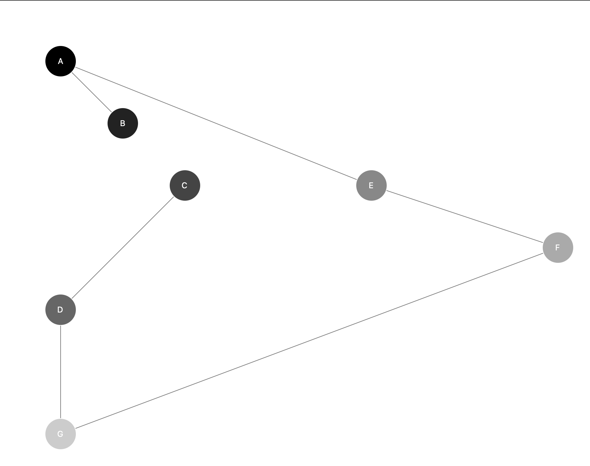

# Traveling salesman problem (with genetic algorithm)

This is a python script to try to solve the traveling salesman problem with a genetic algorithm.

## Install
```shell
pip3 install -r requirements.txt
```

## Usage

You need to click on the gui to come to the next step.\
Each click is one new generation.

```shell
python3 traveling_salesman.py

--help -h: show usage
--initial-gens -i: amount of initial gens
--fitness-function -f: 1 - manhattan distance, 2 - pythagorean distance
--selection-amount -s: amount of the selection
--crossover-amount -c: amount of crossovers
--mutation-amount -m: amount of mutations
--mutation-rate -mr: mutation rate
--random-amount -r: amount of randoms in each generation
--max-generations -mg: after that number the program ends
--fitness-goal -fg: after that number the program ends
--nodes -n: the nodes {y,x,name,color} ...
```

### Example

```shell
python3 traveling_salesman.py -i 10 -f 1 -s 3 -c 4 -m 3 -mr 0.2 -r 2 -mg 50 -fg 500 -n 100,100,A,#000 200,200,B,#222 300,300,C,#444 100,500,D,#666 600,300,E,#888 900,400,F,#aaa 100,700,G,#ccc
```

Output\

